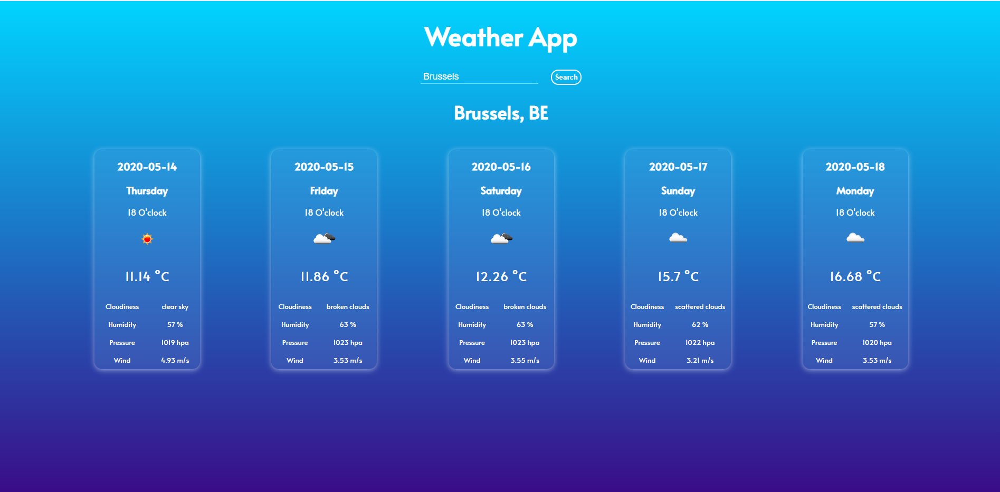

# weather-app
Weather App

## Description

Weather App made with HTML, CSS and Vanilla JS. Fetching data from the https://openweathermap.org/ API.
Used Express.js to make a server and deployed project on Heroku: https://shielded-scrubland-76304.herokuapp.com/

## Screenshot

    

